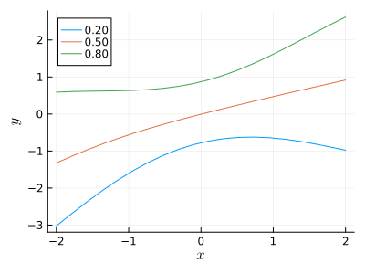

# Local nonparametric quantile regression

This Julia package implements the nonparametric
[quantile regression approach](https://arxiv.org/abs/2012.01758)
of Ye and Padilla (2020).

## Usage

The following example simulates heteroscedastic data and estimates
the 20th, 50th,and 80th conditional quantiles.

````julia
using QuantileNN, Plots, StableRNGs, LaTeXStrings, Statistics, Printf, Distributions
rng = StableRNG(123)

n = 1000
p = 3
X = randn(rng, n, p)
X[:, 1] .= 1
y = X[:, 2] + (1 .+ 2*abs.(X[:, 2])) .* randn(n)

pp = [0.2, 0.5, 0.8]
mm = [fit(QNN, X, y; p=p) for p in pp]

x = range(-2, 2, 20)
bw = 1.0
yy = [[predict_smooth(m, [0, v, 0], [bw]) for v in x] for m in mm]

ps = [@sprintf("%.2f", p) for p in pp]
plt = plot(x, yy[1], label=ps[1], xlabel=L"$x$", ylabel=L"$y$", size=(400,300))
plt = plot!(plt, x, yy[2], label=ps[2])
plt = plot!(plt, x, yy[3], label=ps[3])
Plots.savefig(plt, "./assets/readme1.svg")
````



## References

[1] Steven Siwei Ye and Oscar Hernan Madrid Padilla.  Non-parametric Quantile
Regression via the K-NN Fused Lasso. https://arxiv.org/abs/2012.01758

---

*This page was generated using [Literate.jl](https://github.com/fredrikekre/Literate.jl).*

